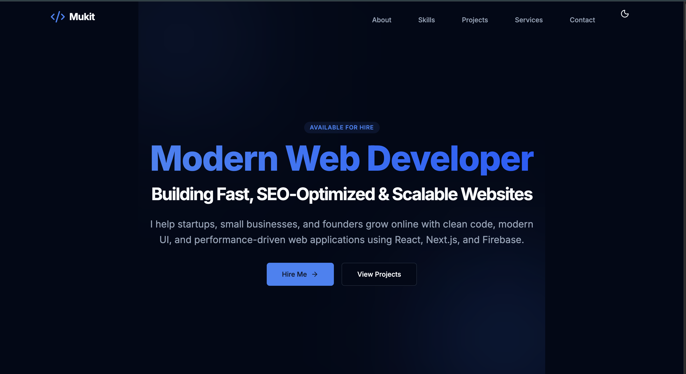

# MD Mukit Hasan - Personal Portfolio

A high-growth, high-traffic, SEO-optimized personal portfolio website designed for a Junior Web Developer. Built with **Next.js 14**, **Tailwind CSS**, and **Framer Motion**, this site focuses on performance, personal branding, and conversion.


*(Note: Add a screenshot of the site here as `public/preview.png`)*

## 🚀 Features

- **High-Performance**: Built on Next.js App Router for optimal speed and SEO.
- **Modern UI/UX**: Glassmorphism, smooth animations (Framer Motion), and a clean, digital-tech aesthetic.
- **Responsive Design**: Mobile-first approach ensuring perfect display on all devices.
- **SEO Optimized**: Semantic HTML, meta tags, and keyword-rich content structure.
- **Dark/Light Mode**: Fully integrated theme switching.
- **Project Case Studies**: Problem-Solution-Result format for showcasing work effectively.
- **Conversion Focused**: Strategically placed CTAs ("Hire Me", "View Projects").

## 🛠 Tech Stack

- **Framework**: [Next.js 14](https://nextjs.org/) (React)
- **Styling**: [Tailwind CSS v4](https://tailwindcss.com/)
- **Animations**: [Framer Motion](https://www.framer.com/motion/)
- **Icons**: [Lucide React](https://lucide.dev/)
- **Deployment**: Vercel / Netlify (Recommended)

## 🏃‍♂️ Getting Started

### Prerequisites

- Node.js 18+ installed

### Installation

1.  Clone the repository:
    ```bash
    git clone https://github.com/mukithasan232/mukit-portfolio-site.git
    cd mukit-portfolio-site
    ```

2.  Install dependencies:
    ```bash
    npm install
    # or
    yarn install
    # or
    pnpm install
    ```

3.  Run the development server:
    ```bash
    npm run dev
    ```

4.  Open [http://localhost:3000](http://localhost:3000) in your browser.

## 📝 Customization

All personal data (Name, Links, Projects, Skills) is centralized in `lib/data.ts`.
Simply edit this file to update the entire website's content without touching the UI code.

```typescript
// lib/data.ts
export const DATA = {
  name: "Your Name",
  role: "Your Role",
  // ...
};
```

## 🚢 Deployment

This project is optimized for deployment on **Vercel**.

1.  Push your code to GitHub.
2.  Import the project in Vercel.
3.  Deploy! (Next.js settings are auto-detected).

## 📄 License

This project is open-source and available under the [MIT License](LICENSE).

---

**MD Mukit Hasan**  
*Modern, Reliable & Growth-Oriented Web Developer*
